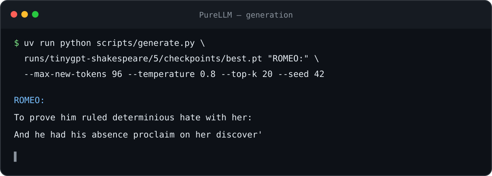
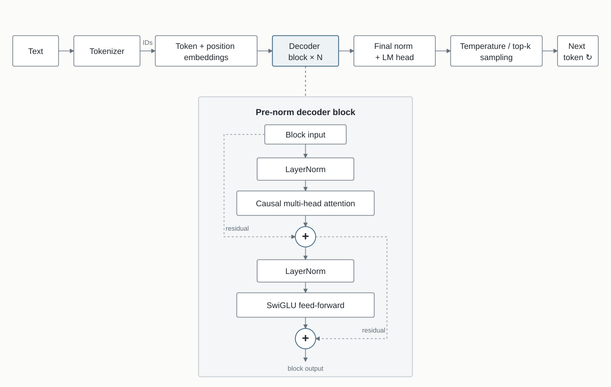

# PureLLM

[](https://github.com/LimeSku/PureLLM/actions/workflows/ci.yml)
[](pyproject.toml)

PureLLM is an educational decoder-only language model implemented twice:
first in NumPy with manual backpropagation, then in PyTorch to explore modern
training and inference techniques without hiding the model behind a high-level
LLM framework.

<p align="center">
  
</p>

<p align="center"><sub>Actual output from a 900-step Shakespeare checkpoint using temperature 0.8, top-k 20, and seed 42.</sub></p>

## Why this project?

LLM frameworks make models easy to use, but they can hide how tokens become
logits, how gradients flow, and which optimizations matter. PureLLM keeps that
path small enough to read end to end.

The NumPy version favors transparency: forward passes, backward passes, and
optimization are explicit. The PyTorch version keeps the architecture visible
while adding the practical pieces needed to train and serve the same model.

## Highlights

- Character-level and byte-pair tokenizers
- TinyGPT implemented in NumPy, including manual backpropagation
- PyTorch implementation with RoPE, SwiGLU, and tied embeddings
- Native PyTorch scaled-dot-product attention
- Mixed-precision training on supported devices
- KV cache and top-k sampling for autoregressive generation
- CPU, Apple Silicon/MPS, and CUDA support
- TOML experiment recipes, checkpoints, and training resume
- FastAPI inference endpoint with interactive OpenAPI documentation

## Architecture

Both implementations follow the same decoder-only language-model flow. The
decoder block is expanded vertically below the horizontal token path:

<p align="center">
  
</p>

## What is implemented from scratch?

- **Tokenization:** character vocabulary and byte-level BPE training, encoding,
  decoding, caching, and serialization.
- **NumPy model:** embeddings, causal multi-head attention, transformer blocks,
  LayerNorm, cross-entropy, manual gradients, gradient clipping, SGD, Adam,
  training, checkpointing, and generation.
- **PyTorch model:** decoder architecture, learned and rotary positions,
  SwiGLU blocks, checkpoint resume, scheduling, KV-cached generation, and the
  inference API.

The PyTorch path intentionally delegates tensor operations, autograd, AdamW,
LayerNorm, and the optimized attention kernel to PyTorch.

## NumPy vs. PyTorch

| | NumPy | PyTorch |
| --- | --- | --- |
| Primary goal | Make every operation inspectable | Train and serve practical experiments |
| Gradients | Manual backward passes | Autograd |
| Attention | Explicit projections, mask, softmax, and backward pass | Native scaled-dot-product attention |
| Model variants | Learned positions and GELU feed-forward | Learned positions or RoPE, plus SwiGLU |
| Optimization | Local SGD and Adam implementations | AdamW, warmup, cosine decay, gradient clipping |
| Generation | Temperature and top-k sampling | Temperature, top-k sampling, and KV cache |
| Hardware | CPU | CPU, MPS, and CUDA |

## Quick start

Requirements: Python 3.13+ and [uv](https://docs.astral.sh/uv/).

```bash
uv sync --locked --dev
uv run python scripts/train.py recipes/tinygpt/shakespeare_smoke.toml
```

For the larger Shakespeare experiment:

```bash
uv run python scripts/train.py recipes/tinygpt/shakespeare.toml
```

Each training command prints its numbered run directory. Generate from its best
checkpoint with:

```bash
RUN=runs/tinygpt-shakespeare/1  # Replace 1 with the printed run number.
uv run python scripts/generate.py \
  "$RUN/checkpoints/best.pt" \
  "ROMEO:" --max-new-tokens 96 --temperature 0.8 --top-k 20 --seed 42
```

Serve the same checkpoint with the inference API:

```bash
PURELLM_CHECKPOINT=runs/tinygpt-shakespeare/1/checkpoints/best.pt \
  uv run uvicorn purellm.api:app
```

The health and generation endpoints are available at `/health` and `/generate`.
Interactive OpenAPI documentation is available at `/docs`.

## Reproducible result

The smoke recipe is the shortest end-to-end check. It fixes the seed, model,
data split, and training settings in versioned TOML:

```bash
uv run python scripts/train.py recipes/tinygpt/shakespeare_smoke.toml
```

Reference result on Apple MPS at commit `fb7fc6b`:

| Metric | Step 1 | Step 10 | Step 20 |
| --- | ---: | ---: | ---: |
| Validation loss | 4.1391 | 3.6944 | 3.5583 |
| Validation perplexity | 62.75 | 40.22 | 35.10 |

The run trains 119,617 parameters and writes its exact config and checkpoints
under `runs/tinygpt-shakespeare-smoke/<run>/`. Last decimals can vary slightly
across CPU, MPS, and CUDA backends.

## Project structure

```text
purellm/
├── numpy/           # NumPy model and manual backpropagation
├── torchgpt/        # PyTorch model, training, and generation
└── tokenization/    # Character and BPE tokenizers

recipes/             # Reproducible TOML experiment configurations
scripts/             # Training, generation, and data preparation
runs/                # Checkpoints, tokenizer caches, and experiment outputs
```

## Limitations

- This is a learning project, not a pretrained foundation model or a
  replacement for production LLM frameworks.
- No pretrained weights or generated datasets are committed; model quality
  depends on the data and training budget you provide.
- Inference currently handles one prompt at a time, and the KV cache is rebuilt
  after the context window fills.
- The NumPy implementation prioritizes clarity over speed, memory efficiency,
  and accelerator support.
- Greedy decoding, top-p sampling, quantization, and distributed training remain
  roadmap items.

See the [roadmap](ROADMAP.md) for planned experiments and improvements.
